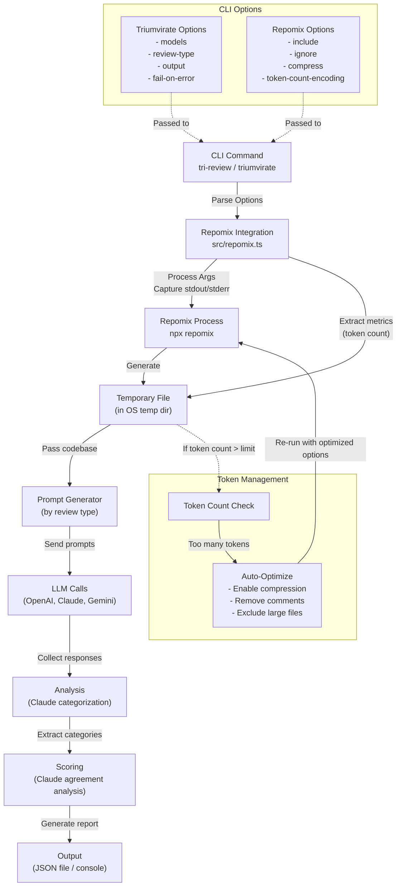

# Triumvirate Plan

When a user calls `npx @justbuild/triumvirate`, the following should happen:

1. the main 'run' command is executed
2. This calls the `repomix` command which packages up the codebase into a temporary file
3. If the number of tokens in the file (as shown by the repomix output) is greater than the token limit for the model, repomix summary and the file structure will be sent to the LLM in order to generate a better repomix command
4. The result of the repomix summary will be passed into a prompt template and sent to each of the LLMs
5. The response from each of the LLMs will be returned along with the cost and latency information
6. The aggregated response will be written to the output file if specified
7. If `fail-on-error` is specified, the process will exit with a non-zero code if any of the LLMs return an error

# Code to pull in the latest repomix

repomix --copy -i tests,*mcp*,website/client/src/de,website/client/src/ja,website/client/src/fr,website/client/src/ko,website/client/src/es,website/client/src/pt-br,website/client/src/zh-cn --top-files-len 20 --compress

## Diagram

1. `npm run dev` should work or fail with good errors
