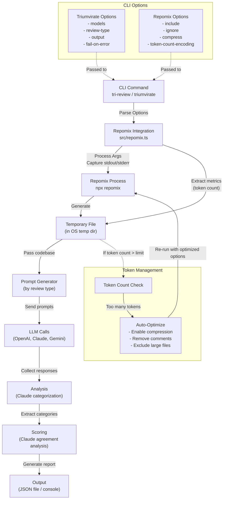

# Triumvirate Plan

When a user calls `npx @justbuild/triumvirate`, the following should happen:

1. the main 'run' command is executed
2. This calls the `repomix` command which packages up the codebase into a temporary file
3. If the number of tokens in the file (as shown by the repomix output) is greater than the token limit for the model, repomix summary and the file structure will be sent to the LLM in order to generate a better repomix command
4. The result of the repomix summary will be passed into a prompt template and sent to each of the LLMs
5. The response from each of the LLMs will be returned along with the cost and latency information
6. The aggregated response will be written to the output file if specified
7. If `fail-on-error` is specified, the process will exit with a non-zero code if any of the LLMs return an error

# Code to pull in the latest repomix

repomix --copy -i tests,*mcp*,website/client/src/de,website/client/src/ja,website/client/src/fr,website/client/src/ko,website/client/src/es,website/client/src/pt-br,website/client/src/zh-cn --top-files-len 20 --compress

## Diagram

## Misc todo items

- `tri-report` as well as `triumvirate` should launch the cli
- specify which models to use for the big report
- specific which model to use for the agentic and report generation side
- wrap the repomix output in a nicer box
- better parse the repomix output to access the token count and results better
- create a script that pulls costs from <https://raw.githubusercontent.com/BerriAI/litellm/refs/heads/main/model_prices_and_context_window.json> and filters them by model to make sure the costs are uptodate.
- cli printout should implement the opencommit format
- add better testing and logging
- make sure the report focus is stearable
- make sure that custom repomix calls and flags are supported
- Add acceptance criteria for the report generation - we can have --pass strict|lenient where lenient will pass if no errors are shared by all three models.  strict will fail if two models agree on any error.
- make the feedback more general. remove the dependency on the code analysis.  This could be used to analyze an obsidian knowledge graph or any collection of files.

Support for a wider range of models:

# Models with >100,000 Token Context Windows

Here are the most sophisticated models that support more than 100,000 tokens, organized by provider:

## OpenAI

- **GPT-4o**: 128,000 tokens
  - Access: <https://platform.openai.com/>

- **GPT-4.5-preview**: 128,000 tokens
  - Access: <https://platform.openai.com/>

- **o1-pro**: 200,000 tokens
  - Access: <https://platform.openai.com/>

## Anthropic

- **Claude 3.7 Sonnet**: 200,000 tokens
  - Access: <https://claude.ai/> or <https://www.anthropic.com/api>

## Google/Vertex AI

- **Gemini 1.5 Pro**: 2,097,152 tokens
  - Access: <https://ai.google.dev/> or <https://console.cloud.google.com/vertex-ai>
- **Gemini 2.5 Pro**: 2,097,152 token
  - Access: <https://ai.google.dev/> or <https://console.cloud.google.com/vertex-ai>

## Meta/Llama Models

- **Llama 3.1-405B**: 128,000 tokens
  - Access via providers:
    - AWS Bedrock: <https://aws.amazon.com/bedrock/>
    - Snowflake: <https://www.snowflake.com/>

## Amazon Bedrock

- **Amazon Nova Pro**: 300,000 tokens
  - Access: <https://aws.amazon.com/bedrock/>

## AI21

- **Jamba 1.5 Large**: 256,000 tokens
  - Access: <https://www.ai21.com/> or <https://aws.amazon.com/bedrock/>

## Snowflake

- **Jamba Large**: 256,000 tokens
  - Access: <https://www.snowflake.com/>

## Fireworks AI

- **Mixtral-8x22B-Instruct**: 65,536 tokens (included as a noteworthy model with large context)
  - Access: <https://fireworks.ai/>

## Perplexity

- **Sonar Pro**: 200,000 tokens
  - Access: <https://www.perplexity.ai/>

# Also

- Store configuration settings and api keys in ~/.triumvirate/config.json
- Implement the badging system
- Test the context window shortening agentic calls
- Swap out the report generation agent to use openai or claude or a different model
- Enable richer prompt engineering on the feedback side - Generate task prompts
- Add formatting for the md to ensure linting is good.
- Implement this as a github action to run on PRs and pushes to main
